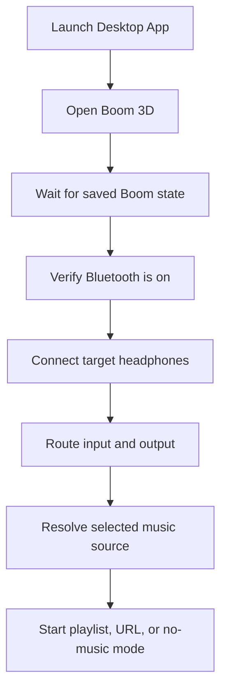

# Lock-In Audio Workflow

Local-first macOS audio workflow for starting a focused work session with one action.

The workflow opens Boom 3D, restores its saved processing state, connects a target Bluetooth headset, routes system audio to that device, and then starts a selected music source. It also includes a second desktop action for maintaining named music sources without editing files by hand.

## Scope

This repository documents and stores the source-of-truth implementation for a personal macOS audio launch workflow built around:

- Boom 3D
- Bluetooth headphones
- Apple Music playlists
- Web-based music URLs
- AppleScript desktop launchers

## Features

- Opens `Boom 3D.app` first and uses its persisted local configuration
- Connects a named Bluetooth headset with retries
- Routes default input and output to the selected headset
- Starts a playlist, URL, or no-music mode
- Supports named music sources from a TSV registry
- Provides a desktop action to add, remove, and view music sources

## Repository Layout

```text
.
├── README.md
├── docs/
│   └── USER_MANUAL.md
├── apps/
│   ├── lock_in_headphones.applescript
│   └── manage_music_sources.applescript
└── scripts/
    ├── build_desktop_apps.sh
    ├── lock-in-headphones.sh
    └── lock-in-music-sources.tsv
```

## Workflow



## Requirements

- macOS on Apple Silicon
- `Boom 3D.app` installed at `/Applications/Boom 3D.app`
- Homebrew
- `blueutil`
- `switchaudio-osx`
- AppleScript access for local automation

Install command-line dependencies:

```bash
brew install blueutil switchaudio-osx
```

## Build

The repo keeps AppleScript source templates in `apps/` and compiles deliverable desktop apps into `dist/`.

Build them with:

```bash
./scripts/build_desktop_apps.sh
```

This produces:

- `dist/Lock In Headphones.app`
- `dist/Manage Music Sources.app`

## Configuration Model

The workflow is intentionally deterministic and low-maintenance.

- Boom 3D configuration is not rebuilt from code on every run.
- The script opens Boom 3D and relies on the app's own persisted state.
- Music source labels and their underlying playlist names or URLs live in `scripts/lock-in-music-sources.tsv`.

That split keeps the workflow stable:

- app state stays in Boom 3D where it already belongs
- source labels stay versioned in the repo
- launch logic stays in one shell entry point

## Operational Notes

- The target headset is currently configured as `beats4`.
- `Headphones Only` mode skips music startup but still opens Boom 3D and routes audio.
- URL sources are opened with `open`.
- Playlist sources are played through Apple Music.

## Security and Privacy

- Local-first execution only
- No cloud dependency for runtime workflow control
- No credential storage in the repository
- No hidden background agents required

## Troubleshooting

- If Boom 3D is missing, install it in `/Applications`.
- If Bluetooth connection stalls, verify the headset is powered on and nearby.
- If the Apple Music step times out, headphone routing still completes.
- If a source label breaks, inspect `scripts/lock-in-music-sources.tsv` for malformed tabs or blank values.

Detailed usage is in [USER_MANUAL](docs/USER_MANUAL.md).

